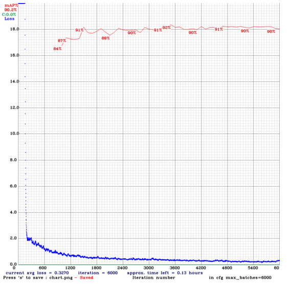

# License-number-extraction-YOLOV4
The objective is to extract the registration/license plate number from different vehicle images. The task is divided into two parts. First, detect the possible ROI(region of interest) - in this case, it is the license plate of vehicles. Second, extract the letters and numbers from the detected region. To separate ROI from the images, object detection model - YOLO v4 is used. YOLO v4 (You only look once) is a family of one-stage object detectors that are fast (i.e., able to give real-time results) and accurate. To support license plate detection, this model is trained with a custom dataset. The trained model can separate multiple ROI's(i.e., license plates) from the image. The detected license plate images are then processed for OCR (i.e., Optical Character Recognition).  

• 1000 custom dataset is collected from the [Open Images Dataset V6](https://storage.googleapis.com/openimages/web/index.html) to train the YOLO v4 model. 
• The performance achieved from the model is Mean Average Precision, mAP = 91%.  
• The model can detect multiple ROI's (license plate images).  
• Google Vision API is used to extract the numbers/letters from the detected license plates.  

The original YOLOV4 model is pretrained with [MS coco](https://cocodataset.org/#home) dataset. The model can detect objects in real-time.

# Performance with custom data:

### Test 1:

### Test 2:

### Test 3:

### Test 4:

### Test 5:

### Test 6

# How to Run:
Please check the License Plate Extraction.ipynb file for the detailed analysis. The supported files can be found in the 'support' directory. 
